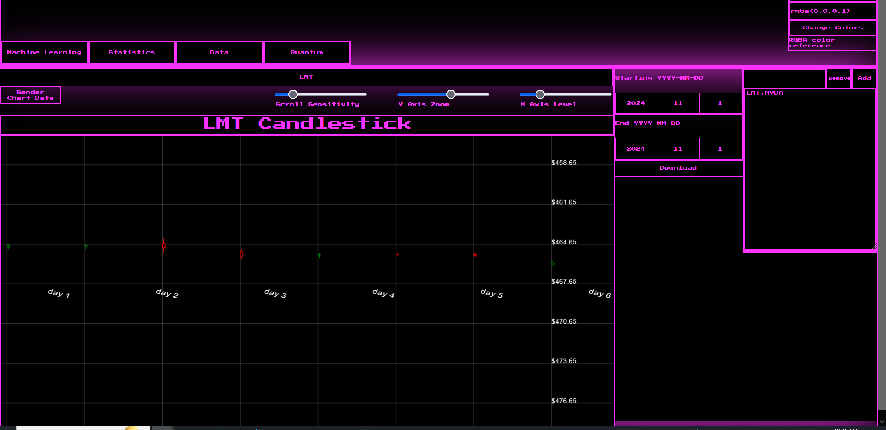
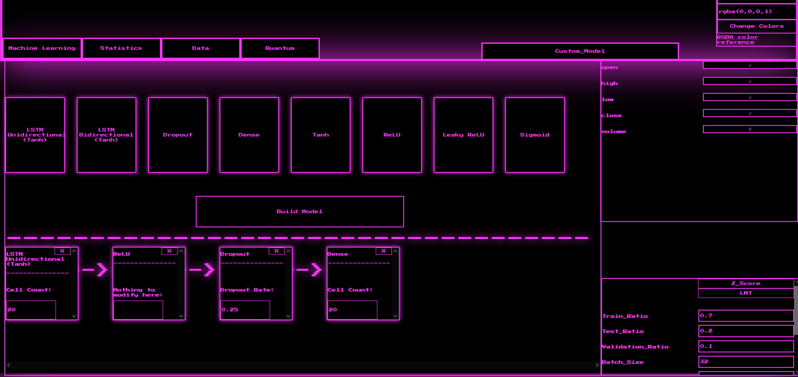
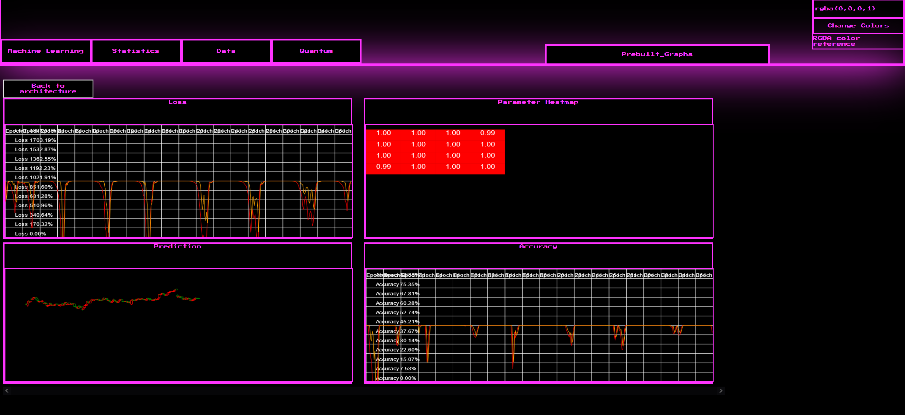
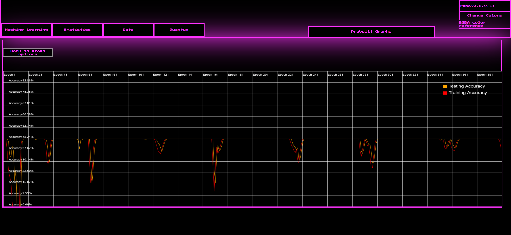
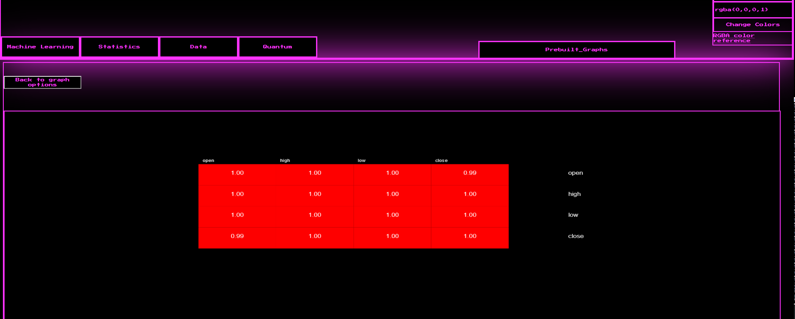
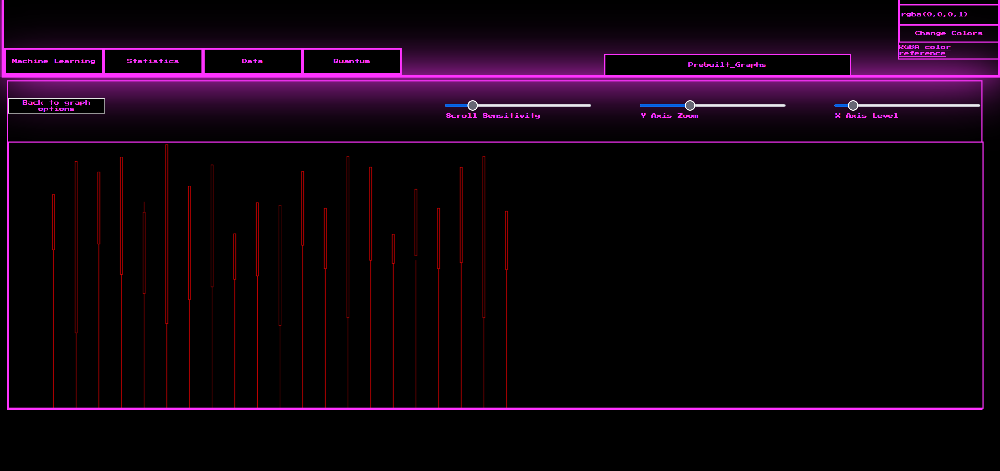
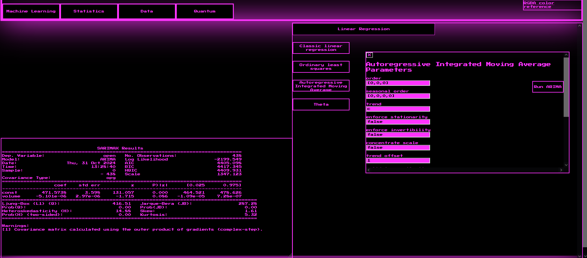
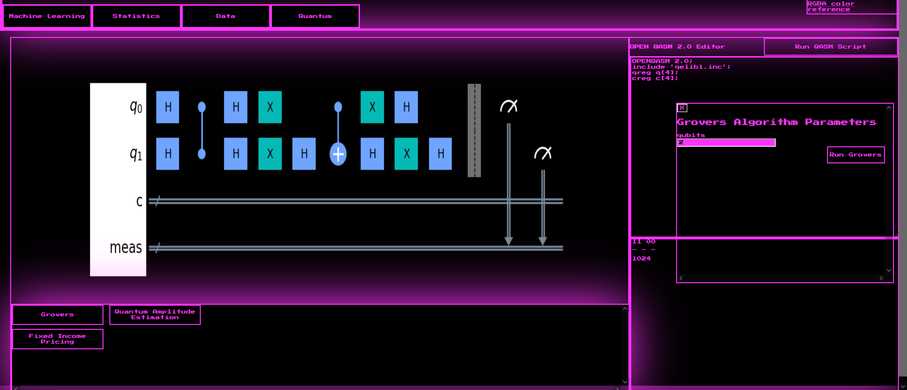

# Peek a browser-based GUI


## What is the goal of this project?
This project's end-goal is to be a technical analysis tool for stock analysis using machine learning, statistical methods, and experimental quantum finance algorithms to help traders make well-informed decisions on the stock they are looking to buy/sell. This tool will be able to gather, process, and manipulate stock data for tasks ranging from machine learning / linear regression based forecasting to technical indicators and portfolio optimization. Some future functionalities will include:


- LSTM based forecasting
- VAE based anomaly detection
- Statistical measurements like mean, mode, standard deviation, ect
- Technical indicators like MACD
- Quantum risk management algorithms like QAOA
- Quantum/Classic machine learning hybrids like QSVM's
- Fully interactable charts for candlesticks, individual variable analysis, and technical indicators


## Prerequisites
Since this project is built out of Python and React using Node, you are going to need `Python 3.1.5` and `Node.js v22.5.1` installed to continue alongside their respective package managers, pip and npm. There are also external dependencies that need to be installed on both sides:


### Python:
#### (Torches actual version is 2.2.2+cu118)
```
pip3 install Torch==2.2.2
pip3 install statsmodels==0.14.0
pip3 install numpy==1.24.3
pip3 install pandas==1.5.3
pip3 install matplotlib==3.7.1
pip3 install qiskit==0.45.0
pip3 install qiskit_algorithms==0.3.0
pip3 install qiskit_finance==0.4.1
pip3 install flask==3.0.3
pip3 install flask_cors==4.0.1
pip3 install qiskit_aer==0.12.0
pip3 install pylatexenc==2.10
```
### Node:
```
npm install react@18.3.1 react-dom@18.3.1
npm install react-scripts --save
npm i web-vitals --save-dev
```
## How do I launch the application?
If you are Windows there are two batch files called `StartAPI.bat` and `StartApp.bat`, launch them both and when React is ready it will pop a new tab with the application. If you are on Linux or MAC the three commands to start the app are `python API.py`, `cd ./react_gui`, and `npm start`.


## Using the download dashboard
This dashboard is pretty straightforward and really only controls downloading data for each company's ticker given to the boxes on the right and within the date ranges selected left to the ticker input boxes. If there is data stored in the `MarketData` folder, when the program launches that data will be automatically loaded so there is no need to interact with this dashboard every time you want to perform some other operation like statistics or machine learning. The dashboard does also have a candlestick chart that will be generated when a ticker is selected from the dropdown in the middle of the top of the dashboard and the `render chart data` button is selected. The graph generated can be dragged to move the X axis back and forth, X axis scroll sensitivity, Y axis zoom, and X axis leveling controlled through sliders on the top right of the graph.



## Using the machine learning dashboard
As explained previously, if there is data in the `MarketData` folder it will be automatically loaded, so there are no steps required before performing machine learning tasks, you can just load the application and start augmenting the hyperparameters listed off to the right and train the model when ready. Aside from this there is also a custom machine learning constructor that allows for a user-defined sequential architecture with current support for LSTM (Unidirectional and Bidirectional) Dropout, and Dense layers with Tanh, ReLU, LeakyReLU, and Sigmoid activation functions alongside the added variables that you can mix and match at the top right and the hyperparameters from the pervious dash at the bottom right. While there is nearly unlimited free reign here there is only one consideration that should be made. Layers like LSTM and Dense operate a bit differently with one-to-one inputs, the outputs need to have some sort of nonlinearity introduced so NaN outputs are not produced causing PyTorch to crash. Standalone LSTM layers with proceeding layers are usually fine but if LSTM layers are stacked (LSTM->LSTM) there should be a activation function in-between to negate this issue (LSTM->ReLU->LSTM->...). Otherwise there is full range of customization.












## Using the statistics dashboard
There are only a few functions that can be performed here currently, all linear regression, there is a drop down but currently only has the option for linear regression. The available models are Theta, Ordinary Least Squares (OLS), Classic LR (line of best fit), and Autoregressive Integrated Moving Average (ARIMA), when each button is clicked a pop-up with parameters will appear and the button to run the model, when the parameters are set and the model is ran the results will appear in a text box in the bottom left of the page.





## Using the quantum dashboard
As of now the quantum dashboard only has a handful of prebuilt algorithms with an open quantum assembly editor and circuit viewer. The prebuilt algorithms have no financial use right now but still can be run as a general algorithm. For the Open quantum assembly editor you can directly write QASM code right into the editor and click `run QASM` whenever you are ready to run the script. This will run a quantum simulation on the backend locally (there are future plans to optionally send the algorithm to IBM's quantum computers through their IBMQ API). When the job is done the counts are returned to an output box below the QASM editor and the circuit will be drawn in a different component to the left of the editor.



## A warning about machine learning and statistics for market analysis
In technical market analysis, everything is centered around the statistics of the market data itself and most traders/economists recognize that these are nothing more than **possible** indications and directions of the market they are analyzing. Machine learning for market analysis works the same way, it is not an all knowing oracle or even a really close guess, just like technical indicators, regression models, and statistical measurements machine learning is another tool to use in order to provide a clearer understanding of the dataset. While these models can process stock datasets in a much more powerful and fundamentally different way to that of technical indicators or statistics it's supposed to work in conjunction with technical indicators and statistics. Something to keep in mind as you are using this application, do not make trades on the predictions of machine learning models alone they are not all knowing.